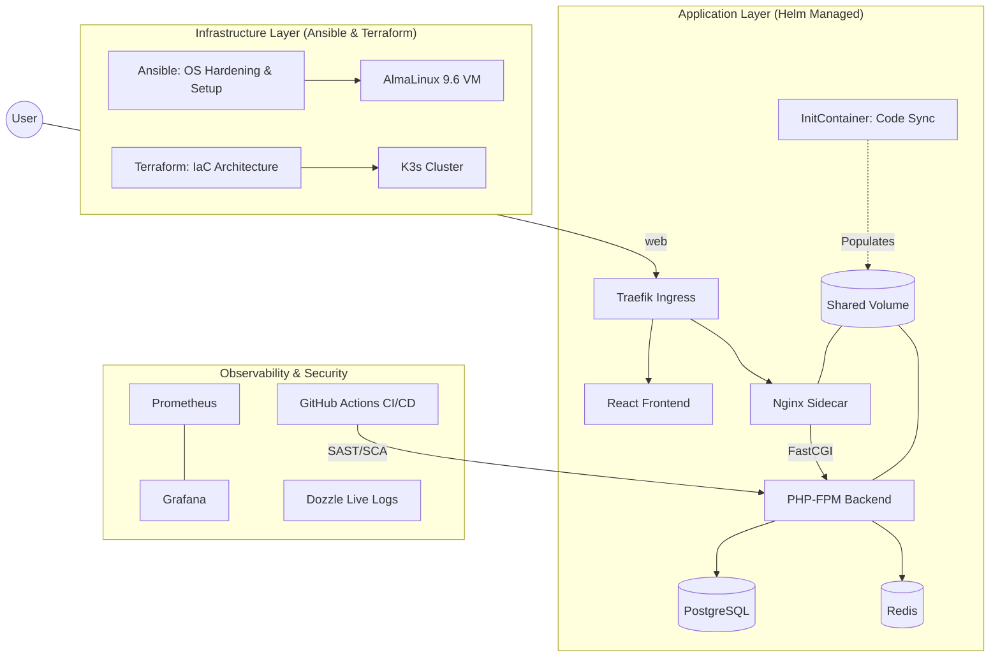

# 🛡️ SecureOps-CRM: DevSecOps-First CRM Platform

**SecureOps-CRM** is a production-grade, high-security CRM platform engineered with **Laravel 11**, **React**, and a comprehensive **DevSecOps** ecosystem. This project demonstrates mastery over advanced infrastructure automation, deep observability, and a "Shift-Left" security culture, specifically optimized for local-only, cloud-agnostic environments.

---

##  The DevSecOps Architecture

---

##  Key Features

### Application Excellence
- **Cinematic UX**: React + Tailwind CSS with glassmorphism and subtle micro-animations.
- **Production Architecture**: High-performance **PHP-FPM + Nginx** sidecar pattern for 3x throughput over built-in servers.
- **Auto-Bootstrapping**: Integrated **InitContainer** logic to manage shared application volumes in Kubernetes.
- **Security Intelligence**: Built-in **Audit Logging Engine** that tracks model changes and user activity.

### 🛡️ DevSecOps & Automation (The Master Stack)
- **Infrastructure as Code (IaC)**: Unified **Terraform** suite managing Kubernetes namespaces and **Helm** releases.
- **Automated Configuration**: **Ansible** Master Playbook for "Day Zero" OS hardening and K3s provisioning.
- **Performance Hardening**: Hardware-accelerated **PHP OpCache** and build-time Laravel caching optimizations.
- **Next-Gen Observability**: 
    - **Prometheus & Grafana**: Real-time infrastructure and application metrics.
    - **Dozzle**: Live, lightweight container log visualization.

---

## 📁 Repository Guide

| Directory | Purpose |
| :--- | :--- |
| **`.github/workflows/`** | The "Security Handshake" (Automated CI/CD). | |
| **`backend/`** | Laravel 11 Secure API + PHP-FPM Configuration. |
| **`frontend/`** | React Modern Cinematic Dashboard. |
| **`infrastructure/ansible/`** | Automated OS Hardening & Server Setup. |
| **`infrastructure/terraform/`** | Cluster Architecture & App Lifecycle Management. |
| **`k8s/helm/`** | Standardized Sidecar-Enabled Helm Charts. |
| **`k8s/monitoring/`** | Prometheus, Grafana, & Dozzle Manifests. |

---

---

##  Continuous Compliance
Every commit undergoes a rigorous security handshake:
- **Secret Scanning (Gitleaks)**: Zero-leakage policy for credentials.
- **SAST (Larastan)**: Automated codebase auditing for security vulnerabilities.
- **SCA (NPM/Composer Audit)**: Continuous monitoring of the supply chain.

---
*Created as a "God-Level" DevSecOps Showcase.*
