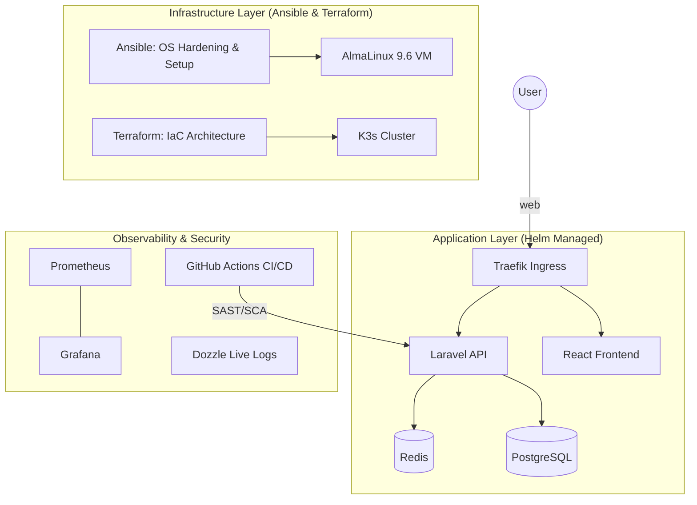

# 🛡️ SecureOps-CRM: DevSecOps-First CRM Platform

**SecureOps-CRM** is a production-grade, high-security CRM platform engineered with **Laravel 11**, **React**, and a comprehensive **DevSecOps** ecosystem. This project demonstrates mastery over advanced infrastructure automation, deep observability, and a "Shift-Left" security culture, specifically optimized for local-only, cloud-agnostic environments.

---

##  The DevSecOps Architecture

---

##  Key Features

### Application Excellence
- **Cinematic UX**: React + Tailwind CSS with glassmorphism and subtle micro-animations.
- **Security Intelligence**: Built-in **Audit Logging Engine** that tracks model changes and user activity.
- **Robust API**: Professional Laravel 11 architecture with strict validation and resource encapsulation.

### 🛡️ DevSecOps & Automation (The Master Stack)
- **Infrastructure as Code (IaC)**: Unified **Terraform** suite managing Kubernetes namespaces and **Helm** releases.
- **Automated Configuration**: **Ansible** Master Playbook for "Day Zero" OS hardening and K3s provisioning.
- **High-Availability Orchestration**: Lightweight **K3s (Kubernetes)** cluster with permanent Ingress routing.
- **Next-Gen Observability**: 
    - **Prometheus & Grafana**: Real-time infrastructure and application metrics.
    - **Dozzle**: Live, lightweight container log visualization.

---

## 📁 Repository Guide

| Directory | Purpose |
| :--- | :--- |
| **`.github/workflows/`** | The "Security Handshake" (Automated CI/CD). |
| **`backend/`** | Laravel 11 Secure API Core. |
| **`frontend/`** | React Modern Cinematic Dashboard. |
| **`infrastructure/ansible/`** | Automated OS Hardening & Server Setup. |
| **`infrastructure/terraform/`** | Cluster Architecture & App Lifecycle Management. |
| **`k8s/helm/`** | Standardized Application Packaging. |
| **`k8s/monitoring/`** | Prometheus, Grafana, & Dozzle Manifests. |

---

## 📖 Essential Documentation
For deep dives into specific components, refer to the following master guides:
1.  **[AUTOMATION_MASTER_GUIDE.md](docs/AUTOMATION_MASTER_GUIDE.md)**: Zero-to-Hero IaC setup.
2.  **[PromandGraf.md](docs/PromandGraf.md)**: Complete Monitoring and Dashboarding setup.
3.  **[CV_PROJECT_DESCRIPTION.md](docs/CV_PROJECT_DESCRIPTION.md)**: High-impact bullet points for your resume.
4.  **[VERIFICATION_GUIDE.md](docs/VERIFICATION_GUIDE.md)**: Proof-of-work testing steps for the production stack.

---

##  Continuous Compliance
Every commit undergoes a rigorous security handshake:
- **Secret Scanning (Gitleaks)**: Zero-leakage policy for credentials.
- **SAST (Larastan)**: Automated codebase auditing for security vulnerabilities.
- **SCA (NPM/Composer Audit)**: Continuous monitoring of the supply chain.

---
*Created as a DevSecOps Showcase.*
